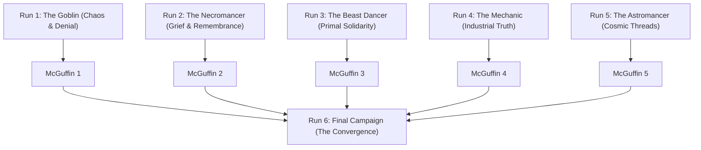

# Goblin Cannon — Master Roadmap and Game Vision

## 1. Executive Summary

Goblin Cannon is a physics-driven auto-battler and active incremental game.
The player builds a chaotic mana circuit board to power a siege cannon.
The game combines plinko ball physics, deep drafting, and a dark comic book story across six campaigns.

---

## 2. Core Gameplay Identity: Hands-On vs Hands-Off Incremental

The game uses a **Hybrid Active Incremental** structure.

### 2.1 The Split Between Hands-On and Hands-Off

- **Hands-Off (Automated Execution):**
  - The hopper releases balls at regular intervals.
  - Balls bounce through the pegboard with 2D physics.
  - Energy routes automatically to the main cannon, sidearms, and shields.
  - Cannons and sidearms fire automatically when energy pools fill.

- **Hands-On (Tactical Player Agency):**
  - **Drafting Decisions:** The player selects balls, peg modifications, and stat upgrades at milestones.
  - **Board Customization:** The player buys, removes, moves, and upgrades pegs.
  - **Wave Timing and Gate Control:** The player can trigger manual hopper releases or activate burst valves.
  - **Active Character Abilities:** Each character has special tactical skills that the player activates during combat.

---

## 3. Narrative Architecture: Six-Playthrough Campaign

The narrative unfolds through six distinct playthroughs.
Each playthrough reveals new context about the world, the kingdoms, and the tragic past of the Goblin.



### 3.1 Playthrough 1: The Goblin (The Broken Engineer)

- **Surface Persona:** A hyperactive, happy-go-lucky goblin who loves explosions and destruction.
- **Narrative Reality:** The goblin experiences a psychotic break after an extreme personal tragedy caused by the kingdoms.
- **Tone:** Starts as a cartoon comedy. Dark hints appear as the walls fall.
- **Unique Mechanic:** **The Goblin Scrap Shop.** The goblin collects gold and scrap to buy balls and items from a traveling merchant.
- **Reward:** The First Reality Shard (McGuffin 1).

### 3.2 Playthrough 2: The Necromancer (The Silent Witness)

- **World Perspective:** Explores the cemetery outskirts and reveals the casualties of kingdom expansion.
- **Narrative Link:** Tells the story of the goblin family and how the city guards destroyed their home.
- **Unique Mechanic:** **Soul Harvest and Bone Forging.** Replaces the merchant shop. Fallen enemy souls power peg enhancements and reanimate spent balls.
- **Reward:** The Second Reality Shard (McGuffin 2).

### 3.3 Playthrough 3: The Beast Dancer (The Wild Guardian)

- **World Perspective:** Explores the destroyed forests and wild frontiers outside the civilized cities.
- **Narrative Link:** Shows how the kingdoms displaced the wild tribes and captured the sacred beasts.
- **Unique Mechanic:** **Pack Symbiosis and Beast Feeding.** Replaces the merchant shop. Balls act as beasts that gain permanent mutations when they hit food pegs.
- **Reward:** The Third Reality Shard (McGuffin 3).

### 3.4 Playthrough 4: The Mechanic (The Exiled Architect)

- **World Perspective:** Explores the industrial heart of the kingdom and the exploitation of labor.
- **Narrative Link:** Reveals that the high kingdom stole the siege engine blueprints from the goblin and threw him into exile.
- **Unique Mechanic:** **Modular Wiring Grid.** Replaces the merchant shop. The player connects components on a circuit grid to multiply voltage and energy transfer.
- **Reward:** The Fourth Reality Shard (McGuffin 4).

### 3.5 Playthrough 5: The Astromancer (The Cosmic Weaver)

- **World Perspective:** Explores the ancient observatories and timeline anomalies.
- **Narrative Link:** Observes the multiverse timelines and seeks a way to undo the core timeline fracture.
- **Unique Mechanic:** **Constellation Weaving.** Replaces the merchant shop. Connecting star pegs in specific geometric patterns triggers planetary alignments and cosmic blasts.
- **Reward:** The Fifth Reality Shard (McGuffin 5).

### 3.6 Playthrough 6: The Final Campaign (The Convergence)

- **Prologue:** Begins with the Goblin before the tragedy. The player experiences the peaceful life and the devastating event.
- **The Turning Point:** At the moment of the mental breakdown, the five Reality Shards activate.
- **The Convergence:** The four allies appear through time portals to support the Goblin before despair takes over.
- **Final Battle:** The five characters unite their unique systems to break the High Citadel and establish lasting peace.

---

## 4. UI and Visual Transformation: Comic Book Aesthetic

The game uses a **Pulp Fantasy Comic Book** style inspired by graphic novels and games such as *Slots & Daggers*.

### 4.1 Right Panel UI Redesign

- Transform the current right panel into a clear, communicative combat terminal.
- Show live telemetry:
  - Total Damage Per Second (DPS).
  - Energy routing distribution bars (Main Cannon, Sidearms, Shields).
  - Active status effect timers (Fire, Frozen, Lightning).
  - Enemy formation breakdown and wall integrity meters.

### 4.2 Comic Cutout Action Bubbles

- When the main cannon or sidearms fire, a dynamic comic book panel pops into view over the battlefield.
- The panel shows a brief animated mini-cutscene:
  - The Goblin pulls the firing cord with dramatic comic expressions.
  - The cannon fires a muzzle blast with halftone action lines and text effects ("BOOM!", "KRAK!").
  - The projectile strikes the active wall segment.

```
+-------------------------------------------------------+
|  [ COMIC ACTION POPUP ]                               |
|  +-------------------------------------------------+  |
|  | (o_O) -> [ CANNON FIRE! ] -> [ WALL CRACK! ]   |  |
|  | "EAT THIS, SHIRE KINGS!"                        |  |
|  +-------------------------------------------------+  |
+-------------------------------------------------------+
```

### 4.3 Multi-State Health and Damage Visuals

All key assets have multiple visual damage states:
- **Goblin Character:** High Morale (confident) -> Strained (sweating/angry) -> Manic (desperate).
- **Cannon:** Clean Iron -> Overheated (glowing orange) -> Structurally Damaged (cracks and smoke).
- **City Walls:** Pristine Stone -> Fractured Masonry -> Critical Collapse (burning breaches).

### 4.4 Full-Screen Conquest Cutscenes

When a major milestone wall collapses (Wall 1, Wall 2, and City Boss):
1. The game pauses combat.
2. A full-screen comic splash page takes over the display.
3. Dynamic panels illustrate:
   - The final wall explosion.
   - The enemy retreat.
   - The conquest reward loot chest opening.
4. The screen transitions to the next sector and combat resumes.

---

## 5. Development Phases and Milestones

| Phase | Target Area | Key Deliverables |
| :--- | :--- | :--- |
| **Phase 1** | Task System & Architecture | Markdown backlog, Git PR rules, documentation baseline. |
| **Phase 2** | UI & Comic Presentation | Right panel UI overhaul, comic cutout bubbles, damage state art. |
| **Phase 3** | Campaign Progression System | Character select framework, campaign state persistence, McGuffin tracking. |
| **Phase 4** | Character Bespoke Mechanics | Soul harvest, beast feeding, wiring grid, constellation weaving. |
| **Phase 5** | Narrative Integration | Story cutscenes, tragedy prologue, convergence finale. |
| **Phase 6** | Polish & Sound Design | Comic sound effects, dynamic music, particle VFX, balancing. |
