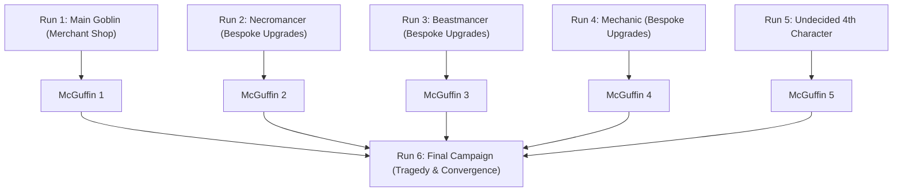

# Goblin Cannon — Master Roadmap and Game Vision

## 1. Executive Summary

Goblin Cannon is a physics-driven auto-battler and active incremental game.
The player builds a chaotic mana circuit board to power a siege engine.
The game combines plinko ball physics, deep drafting, and a comic book narrative across six campaigns.

---

## 2. Core Gameplay Identity: Hands-On vs Hands-Off Incremental

The game uses a **Hybrid Active Incremental** structure.

### 2.1 Hands-Off Systems (Automated Execution)

- The hopper releases balls at regular intervals.
- Balls bounce through the pegboard with 2D physics.
- Energy routes automatically to weapons and shields.
- Cannons and sidearms fire automatically when energy pools fill.

### 2.2 Hands-On Systems (Active Player Agency)

- **Drafting Decisions:** The player selects balls, peg modifications, and stat upgrades at milestones.
- **Board Customization:** The player buys, removes, moves, and upgrades pegs.
- **Wave Timing and Gate Control:** The player can trigger manual hopper releases or activate burst valves.
- **Active Character Abilities:** Each character has tactical skills that the player activates during combat.

---

## 3. Narrative Architecture: Six-Playthrough Campaign

The narrative unfolds through six distinct playthroughs.
The core pegboard remains constant, but each character swaps out a major progression system.

### 3.1 Playthrough 1: The Main Goblin (The Breakdown)

- **Persona:** A happy-go-lucky, zany character who loves explosions.
- **Player Perspective:** The player experiences this as a silly cartoon game without understanding the background context.
- **Unique Mechanic:** The **Merchant Shop** is a unique upgrade mechanic for the main goblin (Runs 1 and 6).
- **Campaign Reward:** The first Infinity Gem style McGuffin.

### 3.2 Playthroughs 2 to 5: The Four Secondary Characters

- **Story Context:** Each secondary playthrough provides narrative context about the world and the main character goblin.
- **The Narrative Reveal:** The player learns that society trampled, suppressed, and destroyed everything the main goblin loved.
- **Emotional Shift:** The player realizes the initial run showed a psychotic breakdown caused by extreme tragedy.
- **Character Roster:**
  1. **The Necromancer:** Playthrough with bespoke non-merchant upgrade mechanics.
  2. **The Beastmancer:** A character whose main mechanic focuses on animals or monsters.
  3. **The Mechanic:** Playthrough with bespoke non-merchant upgrade mechanics.
  4. **Character 4 (Undecided):** Needs final archetype decision.
- **Campaign Rewards:** Each playthrough awards an Infinity Gem style McGuffin.

### 3.3 Playthrough 6: The Final Campaign (The Convergence)

- **Prologue:** Begins with the main character before the tragedy occurs.
- **The Tragedy:** Showcases the devastating event and the breaking point.
- **The Convergence:** All gathered McGuffins activate and pull the other characters across dimensions and timelines.
- **Resolution:** The allies give support to the goblin, and the goblin makes the correct choice for the final battle.

### 3.4 AI Ideas & Suggestions (Optional / Pending User Decision)

> [!NOTE]
> The items below are AI suggestions for non-merchant character upgrade mechanics:
> - **Necromancer Idea:** Soul harvest system where defeated enemy souls enchant pegs.
> - **Beastmancer Idea:** Beast feeding system where balls mutate after hitting food pegs.
> - **Mechanic Idea:** Circuit grid system where components wire together for voltage multipliers.
> - **5th Character Archetype Idea:** An Astromancer (star alignments) or an Exiled Archivist (lore glyphs).

---

## 4. UI and Visual Transformation: Comic Book Feel (Art Style Not Determined)

The game features an overarching **comic book feel**.
The specific art style is not yet determined (*Slots & Daggers* is currently under consideration).

### 4.1 Right Panel UI Redesign

- Transform the current right panel into a clear, communicative UI.
- Show live combat data, damage output, and wall status clearly.

### 4.2 Comic Action Cutout Bubbles

- When the cannon fires, a cutout bubble appears on the screen.
- A tiny mini-cutscene plays inside the cutout bubble showing the cannon firing and hitting the current wall.
- The goblin is part of this cutscene.
- Visual states of the goblin, cannon, and wall represent actual live health values:
  - Requires multiple versions of each asset in different damage states.
  - Creation method: Hand-drawn base states, with variants made by hand or with AI assistance.

### 4.3 Full-Screen Wall Break Conquest Cutscenes

- Triggers when the final city wall breaks in each level (Wall 1, Wall 2, and City Boss).
- A full-screen takeover cutscene shows the city blowing up and the player taking the prize.
- The game then transitions to the next level and play resumes.

---

## 5. Master Task Summary

| Task ID | Title | Priority | Status |
| :--- | :--- | :--- | :--- |
| [TASK-001](file:///c:/Users/josep/Desktop/Games/Goblin-Cannon/docs/tasks/TASK-001-gameplay-loop-and-pacing.md) | Gameplay Loop and Incremental Pacing | P1 | READY |
| [TASK-002](file:///c:/Users/josep/Desktop/Games/Goblin-Cannon/docs/tasks/TASK-002-story-campaign-architecture.md) | Six-Playthrough Story Campaign Architecture | P1 | READY |
| [TASK-003](file:///c:/Users/josep/Desktop/Games/Goblin-Cannon/docs/tasks/TASK-003-character-bespoke-mechanics.md) | Character Bespoke Progression Mechanics | P1 | READY |
| [TASK-004](file:///c:/Users/josep/Desktop/Games/Goblin-Cannon/docs/tasks/TASK-004-right-panel-and-comic-cutouts.md) | Right Panel UI and Comic Cutout Vignettes | P1 | READY |
| [TASK-005](file:///c:/Users/josep/Desktop/Games/Goblin-Cannon/docs/tasks/TASK-005-full-screen-conquest-cutscenes.md) | Full-Screen Wall Break Conquest Cinematics | P2 | BACKLOG |
| [TASK-006](file:///c:/Users/josep/Desktop/Games/Goblin-Cannon/docs/tasks/TASK-006-comic-book-feel-art-style.md) | Comic Book Feel — Art Style Not Determined | P2 | BACKLOG |
| [TASK-007](file:///c:/Users/josep/Desktop/Games/Goblin-Cannon/docs/tasks/TASK-007-pr-workflow-and-version-control.md) | Git Branch and Pull Request Protocol | P0 | DONE |
| [TASK-008](file:///c:/Users/josep/Desktop/Games/Goblin-Cannon/docs/tasks/TASK-008-build-archetypes-and-synergies.md) | Build Archetypes & Synergy Design | P1 | READY |
| [TASK-009](file:///c:/Users/josep/Desktop/Games/Goblin-Cannon/docs/tasks/TASK-009-final-ball-list-campaign-1.md) | Final Ball List & Abilities for Campaign 1 | P1 | BACKLOG |
| [TASK-010](file:///c:/Users/josep/Desktop/Games/Goblin-Cannon/docs/tasks/TASK-010-final-relic-list-campaign-1.md) | Final Relic List & Modifiers for Campaign 1 | P1 | BACKLOG |
| [TASK-011](file:///c:/Users/josep/Desktop/Games/Goblin-Cannon/docs/tasks/TASK-011-character-art-production.md) | Character Art Asset Production | P2 | BACKLOG |
| [TASK-012](file:///c:/Users/josep/Desktop/Games/Goblin-Cannon/docs/tasks/TASK-012-ball-art-production.md) | Ball Sprite & Visual State Asset Production | P2 | BACKLOG |
| [TASK-013](file:///c:/Users/josep/Desktop/Games/Goblin-Cannon/docs/tasks/TASK-013-wall-art-production.md) | Wall & Fortification Multi-State Art Production | P2 | BACKLOG |
| [TASK-014](file:///c:/Users/josep/Desktop/Games/Goblin-Cannon/docs/tasks/TASK-014-cutscene-art-production.md) | Comic Cutout & Takeover Cutscene Art | P2 | BACKLOG |
| [TASK-015](file:///c:/Users/josep/Desktop/Games/Goblin-Cannon/docs/tasks/TASK-015-relic-art-production.md) | Relic Icon & Item Visual Asset Production | P2 | BACKLOG |
| [TASK-016](file:///c:/Users/josep/Desktop/Games/Goblin-Cannon/docs/tasks/TASK-016-typography-and-text-effects.md) | Typography & Comic Text Effect Specifications | P2 | BACKLOG |
| [TASK-017](file:///c:/Users/josep/Desktop/Games/Goblin-Cannon/docs/tasks/TASK-017-ui-art-and-telemetry-panels.md) | UI Art, Frames, and Telemetry Terminal Production | P2 | BACKLOG |
| [TASK-018](file:///c:/Users/josep/Desktop/Games/Goblin-Cannon/docs/tasks/TASK-018-tetromino-module-crafting-and-fusion.md) | Tetromino Module Combining and Fusion Design | P1 | READY |
| [TASK-019](file:///c:/Users/josep/Desktop/Games/Goblin-Cannon/docs/tasks/TASK-019-hopper-steering-controls.md) | Hopper Steering and Active Aiming Controls | P1 | READY |
| [TASK-020](file:///c:/Users/josep/Desktop/Games/Goblin-Cannon/docs/tasks/TASK-020-live-board-ghost-placement.md) | Live Board Ghost State and Placement Physics | P1 | DONE |
| [TASK-021](file:///c:/Users/josep/Desktop/Games/Goblin-Cannon/docs/tasks/TASK-021-wall-siege-timer-and-pushback.md) | Wall Siege Timer, Auto-Progression, and Defender Pushback | P1 | READY |
| [TASK-022](file:///c:/Users/josep/Desktop/Games/Goblin-Cannon/docs/tasks/TASK-022-exponential-scaling-pacing-model.md) | Wall Health Exponential Scaling and Campaign Pacing Model | P1 | READY |
| [TASK-023](file:///c:/Users/josep/Desktop/Games/Goblin-Cannon/docs/tasks/TASK-023-emergency-tinkering-minigames-design.md) | Emergency Tinkering and Machine Breakdown Minigames Design | P2 | BACKLOG |
| [TASK-024](file:///c:/Users/josep/Desktop/Games/Goblin-Cannon/docs/tasks/TASK-024-polyomino-relic-shapes-and-sizes.md) | Polyomino Relic Shapes, Sizes, and Data Definitions | P1 | DONE |
| [TASK-025](file:///c:/Users/josep/Desktop/Games/Goblin-Cannon/docs/tasks/TASK-025-polyomino-drag-drop-and-grid-snapping.md) | Polyomino Drag-and-Drop, Rotation, and Grid Snapping | P1 | DONE |
| [TASK-026](file:///c:/Users/josep/Desktop/Games/Goblin-Cannon/docs/tasks/TASK-026-polyomino-internal-machinery-and-bumpers.md) | Polyomino Internal Kinetic Machinery and Bumper Mechanics | P1 | READY |
| [TASK-027](file:///c:/Users/josep/Desktop/Games/Goblin-Cannon/docs/tasks/TASK-027-junk-box-backpack-inventory-system.md) | Junk Box Backpack Inventory System | P1 | DONE |
| [TASK-028](file:///c:/Users/josep/Desktop/Games/Goblin-Cannon/docs/tasks/TASK-028-junk-box-ui-opening-and-board-transfer.md) | Junk Box UI Opening, Representation, and Board Item Transfer | P1 | DONE |
| [TASK-029](file:///c:/Users/josep/Desktop/Games/Goblin-Cannon/docs/tasks/TASK-029-peg-and-relic-unified-grid-alignment.md) | Peg and Relic Unified Grid Alignment | P1 | DONE |
| [TASK-030](file:///c:/Users/josep/Desktop/Games/Goblin-Cannon/docs/tasks/TASK-030-relic-placement-peg-replacement-and-overlap-prevention.md) | Relic Placement Peg Replacement and Mutual Exclusivity | P1 | READY |
| [TASK-031](file:///c:/Users/josep/Desktop/Games/Goblin-Cannon/docs/tasks/TASK-031-board-relic-repositioning-and-dragging.md) | Board Relic Repositioning and In-Place Dragging | P1 | READY |
| [TASK-032](file:///c:/Users/josep/Desktop/Games/Goblin-Cannon/docs/tasks/TASK-032-relic-audio-level-balancing-and-attenuation.md) | Relic Audio Level Balancing and Volume Attenuation | P1 | DONE |
| [TASK-033](file:///c:/Users/josep/Desktop/Games/Goblin-Cannon/docs/tasks/TASK-033-relic-bounding-enclosures-and-dividing-lanes.md) | Relic Bounding Enclosures, Perimeter Walls, and Dividing Lanes | P1 | READY |
| [TASK-034](file:///c:/Users/josep/Desktop/Games/Goblin-Cannon/docs/tasks/TASK-034-repetitive-sfx-pitch-randomization.md) | Repetitive Sound Effect Pitch Randomization | P1 | DONE |
| [TASK-035](file:///c:/Users/josep/Desktop/Games/Goblin-Cannon/docs/tasks/TASK-035-relic-selection-layout-and-machinery-preview.md) | Relic Selection Screen Layout and Machine Composition Preview | P1 | READY |

