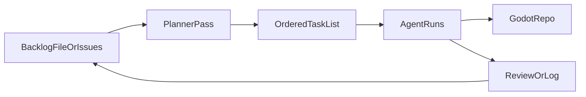

# Local agent orchestration for Godot (Cursor)

**Navigation:** For **where code and tests live**, start with repo root **`CLAUDE.md`** (then `docs/ARCHITECTURE.md`). **This document** is only for **workflow**: backlog, planner vs implementer, isolation, and optional quality loops—not for day-to-day file discovery.

This document describes how to build **agent orchestration** and **planning** workflows for a **solo** indie game in **Godot**, using **Cursor**, without any custom backend, REST task API, or hosted services. The “queue” is **files, git, and conventions**—optionally mirrored by GitHub Issues for visibility.

**Context:** This repo ([Goblin Cannon](https://github.com/foxhollowgames/goblin-cannon)) already version-controls `.cursor` rules and skills; keep agent instructions **in the repo** so they travel with the project.

---

## What you are building

### Orchestration

A small **scheduler** decides what to do next from a backlog, assigns work to an **agent run**, enforces **limits** (one feature branch at a time, sequential runs only, or capped parallelism), and records **outcomes** (done, blocked, needs human).

### Planning

A **planner** pass turns vague goals (“make wave 3 fairer”) into **concrete steps**: checklist items, **dependencies**, **areas of the codebase** (`scenes/`, `simulation/`, `tests/`), and **acceptance criteria**—*before* an implementation agent edits gameplay code.

### Optional unattended runtime

If you later want overnight or scripted runs, use the same pattern with **local** artifacts only: **config in** (what to run, repo path, command), **status out** (log or JSON), **shutdown file** to stop cleanly—no server required.

### Flow (solo, no API)

---

## Layers (file-native, Godot-aware)

| Layer | Responsibility | Solo / Godot approach |
|--------|----------------|------------------------|
| **Backlog** | Single source of “what’s next” | `docs/agent-backlog.md`, or YAML/JSON **task packets** under `docs/agent-tasks/` |
| **Planner** | Decompose, scope, acceptance | Cursor Agent with a **fixed planner prompt** + Rules that **forbid code edits** in planner mode; output → `docs/agent-tasks/task-NNN-plan.md` or backlog updates |
| **Scheduler** | Next task, no double-booking | Manual at first; then a script that reads backlog, writes **`.agent/run.lock`**, runs one agent step; optional cron |
| **Isolation** | Avoid two agents trashing the same scene | Default **sequential**; use **branches** or **git worktrees** for parallel experiments |
| **Implementation agent** | GDScript, scenes, resources | Cursor Agent / Composer + Rules for style; Skills for repeatable commands |
| **Observer** | Short “what happened” | Append to `docs/agent-runs/YYYY-MM-DD.md` or one JSON line per run; optional “summarize last run in 5 bullets” |
| **Quality loop (optional)** | No silent regressions | Script runs tests after a run; **revert** if pass count drops (local **ratchet**, not a service) |

### Godot-specific discipline

- Treat **`project.godot`** and **`.uid` files** as sensitive: agents should not rename or bulk-delete UIDs.
- Prefer **automated verification** you document once (e.g. [GUT](https://github.com/bitwes/Gut), headless quit-after-N patterns) so “done” is objective.
- Have the planner name **systems** (simulation vs UI vs content) to reduce merge conflicts.

---

## Cursor as the hub

You do **not** need MCP or a web dashboard for the core workflow.

- **Rules (`.cursor/rules`):** Split by **mode** if it helps: *planner* (research + plan only), *implementer* (GDScript + scenes), *qa* (run tests, report). Stops one session from both planning and rewriting combat in the same breath.
- **Skills (`.cursor/skills`):** One skill per repeatable procedure: run test suite, export build, prep release notes—callable by you or referenced from task packets.
- **Composer / Agent:** Planning passes and implementation; **orchestration** stays **conventions + small scripts**, not a separate app.

Enterprise-style stacks sometimes add a REST **task API**, dashboards, and pooled workers. That is optional scaling; this doc assumes **one developer, one repo**.

---

## Progressive roadmap

1. **MVP — planning only:** Backlog markdown + planner prompt + Rules. You trigger Agent by hand.
2. **MVP+ — light orchestration:** Task packet schema (`id`, `goal`, `acceptance`, `files_hint`); script picks next task + lock file; single worker.
3. **v2 — quality loop:** After each run, run tests; append results; optional revert on failure.
4. **v3 — unattended (optional):** Cron + same script + `shutdown` file; still **logs only**, no backend.

---

## Prior art (ideas, not dependencies)

Some teams describe a **watchdog** (poll for work), **observer** (summarize activity), and **worker pool** (isolated sessions, e.g. tmux + CLI agents). The useful abstraction is: **scheduler + optional observer + isolated runs + status files**. For a solo Godot project you usually start with **sequential runs + markdown backlog** and only add scripts when the manual flow is stable.

---

## Checklist: which hat are you wearing?

| Phase | Question |
|--------|----------|
| **Planning** | Is the goal split into steps with acceptance criteria and file hints? |
| **Implementation** | Is only one agent run “owning” a scene/system at a time? |
| **Verification** | Did tests or a scripted check run, with results recorded? |
| **Handoff** | If blocked, is the backlog updated for the next session? |

---

## Boundaries

- Prefer **env vars** for any API keys; keep secrets out of git.
- **Slot leasing** and multi-machine pools matter when **many** workers share **one** integration environment—usually overkill for a single Godot repo on one PC.
