# Physical Pinball Playfield Component Analysis

This document provides a strict representation of physical pinball machines and playfield components.
It documents physical mechanics on real pinball tables without game project adaptations.

---

## 1. Strict Physical Pinball Component Taxonomy (With Physical Photos)

Below is the strict representation of physical pinball board components, their mechanical operation, and real physical photos of the objects:

| Component Photo | Physical Component | Mechanical Target Type | Plain-English Physical Operation |
| :---: | :--- | :--- | :--- |
| 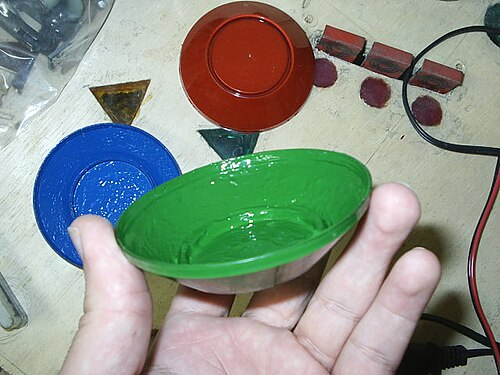 | **Pop Bumpers (Jet Bumpers)** | Active Solenoid Ring | Cylindrical bumpers with a floating ring. When touched, an under-board solenoid fires downward, violently repelling the steel ball. |
| 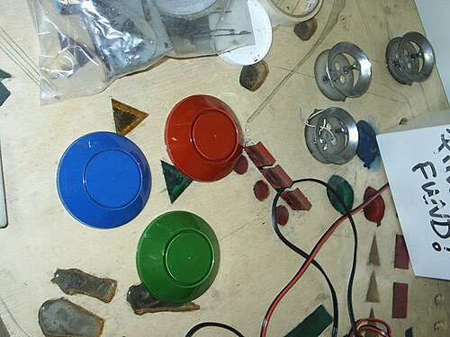 | **Drop Target Banks** | Falling Plastic Plates | Vertical plastic plates over solenoid slots. Hits knock plates flat below the wooden board. Solenoids reset targets upward. |
| 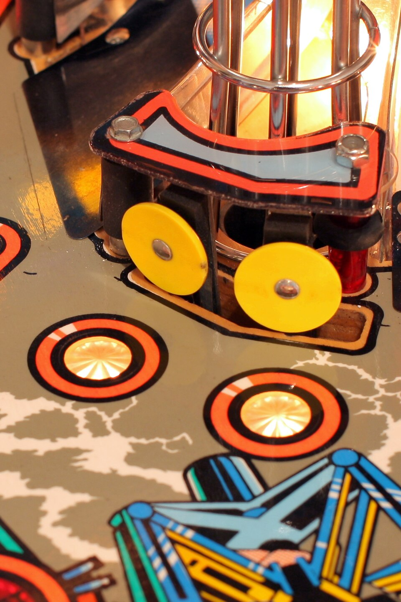 | **Standup Target Banks** | Stationary Leaf Switches | Rigid plastic or metal plates mounted to playfield wood. They stay upright on contact and bounce the ball backwards. |
| 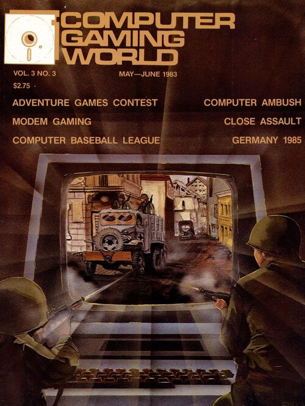 | **Spinners (Spinning Targets)** | Hinged Axle Plate | Metal plates hinged above a lane. Passing balls push under the plate, spinning it rapidly to trigger repeated switch contacts. |
| 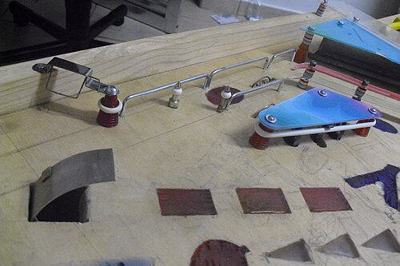 | **Scoops / Sinkholes** | Playfield Surface Cutouts | Holes cut into playfield wood. Balls roll in, fall into under-board troughs to pause play, and eject via solenoid kickers. |
| 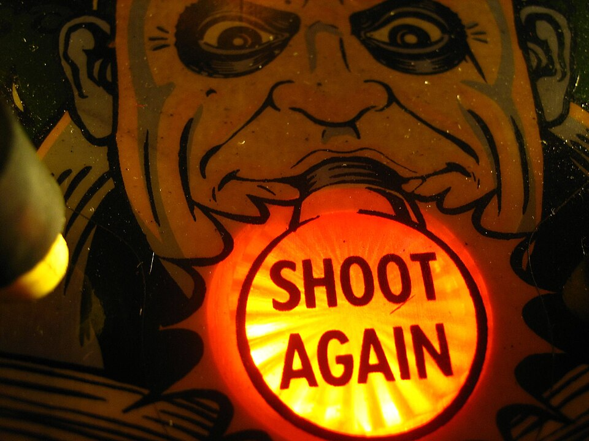 | **Physical Ball Locks** | Under-Board Troughs | Subterranean channels or mechanical traps holding 1 to 3 steel balls. Releasing all balls simultaneously starts Multi-Ball. |
| 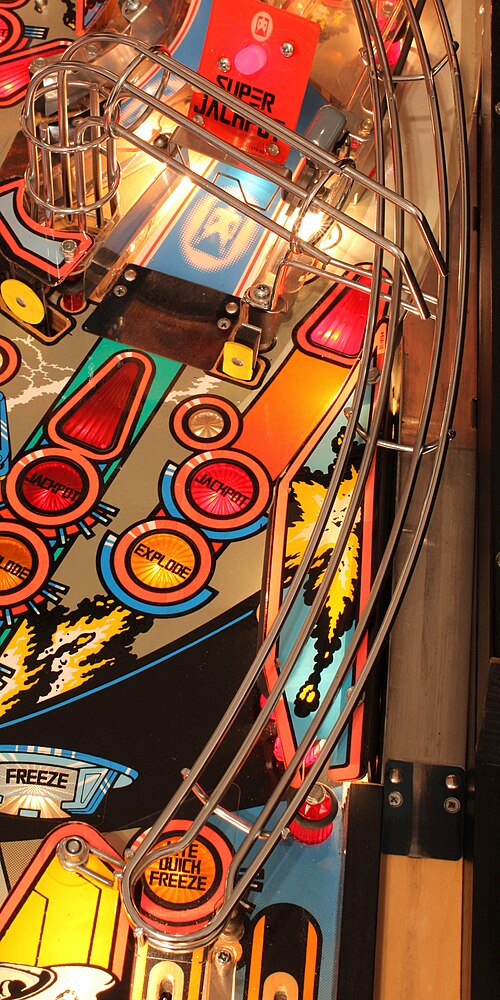 | **Ramps & Habitrails** | Elevated Wire Tracks | Molded inclines and stainless steel wireform tracks. They carry balls over obstacles and deliver gravity returns to flipper lanes. |
| 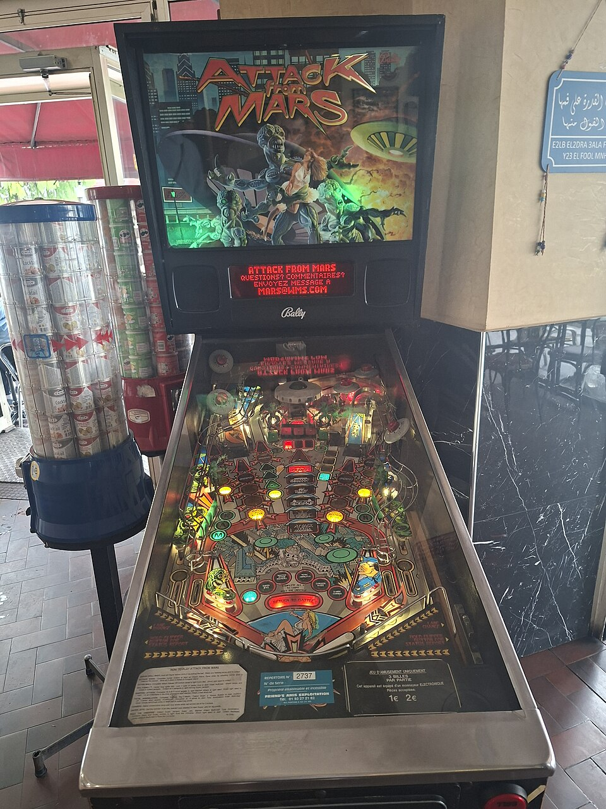 | **Orbits & Loops** | Outer Perimeter Lanes | Smooth curved outer channels along playfield edges. Fast shots travel around the top loop and return down the opposite lane. |
| 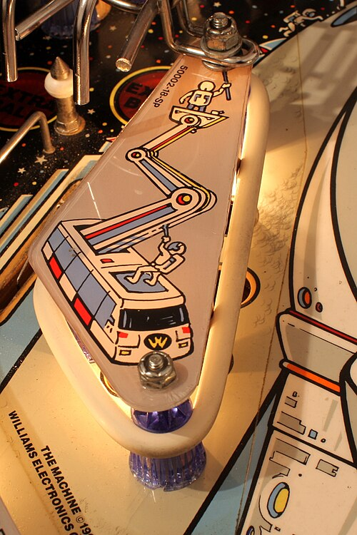 | **Slingshots** | Active Kicker Rubbers | Triangular rubber bands above flippers. Solenoid kicker arms behind the rubber bands launch the ball sideways across the board. |
| 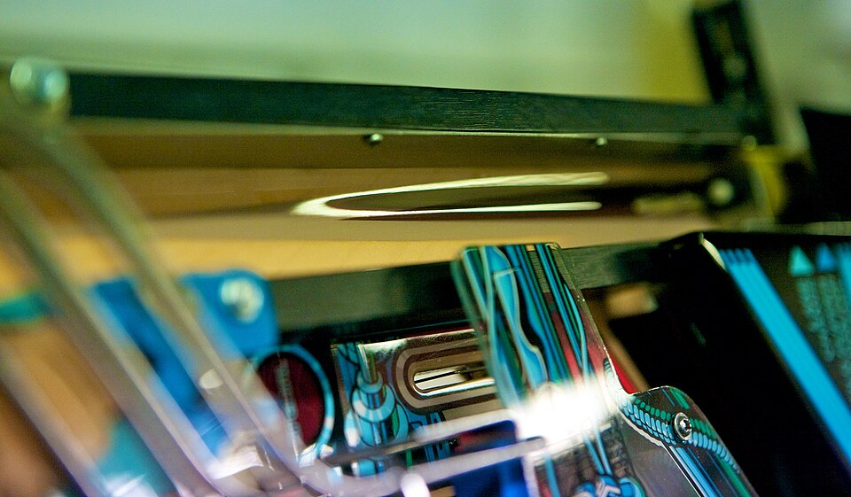 | **Rollover Lanes** | Floor Wire Switches | Narrow channels with wire switch arms protruding through playfield wood. Balls roll over switch arms to register lane lighting. |
| 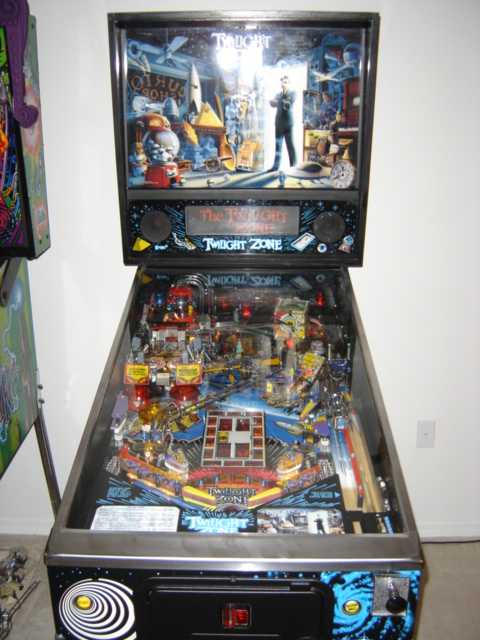 | **Captive Balls / Newton Balls** | Trapped Steel Ball Track | A steel ball trapped inside a short channel in front of a target switch. Ball impacts transfer energy through the trapped ball. |
| 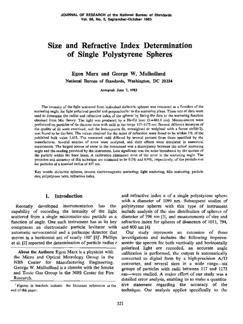 | **Under-Board Magnets** | Electromagnet Coils | Coils under playfield wood. When energized, magnets capture, spin, hold, or throw steel balls in wild trajectories. |
| 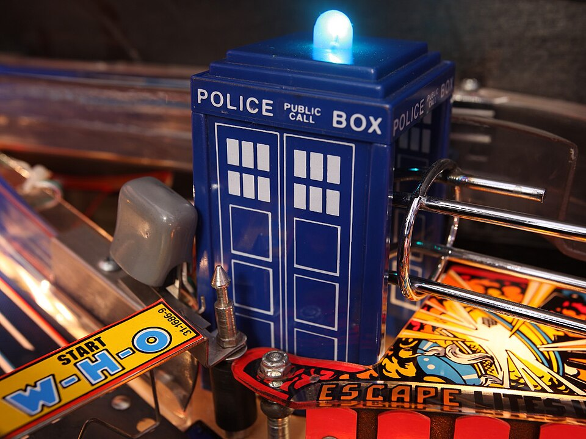 | **Mechanical Diverters** | Solenoid Gate Flappers | Solenoid gates inside ramps or orbits that swing open or closed to redirect balls into different playfield channels. |
| 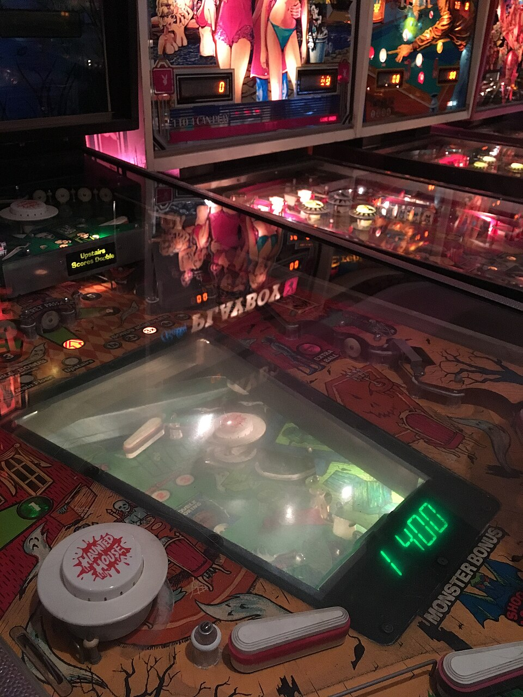 | **Vertical Up Kickers (VUKs)** | Under-Board Plunger Pots | Subterranean solenoid cups. When balls enter the pot under the table, vertical solenoids shoot balls up through board holes to upper rails. |
|  | **Physical Bash Toys** | Motorized Sculptures | Heavy interactive targets (Flying Saucer, Castle Gate). Direct ball hits trigger mechanical shaking, doors opening, or toy damage. |
|  | **Outlane Kickbacks** | Solenoid Plunger Pins | Solenoid pins hidden inside bottom outlanes. Active kickbacks launch balls entering outlanes back onto the main playfield. |

---

## 2. Iconic Physical Pinball Table Case Studies

### 2.1 Twilight Zone (Bally, 1993 - Pat Lawlor)
*   **Physical Features:** Gumball Machine toy, Powerfield magnet board, Ceramic Powerball, Slot Machine scoop.
*   **Mechanical Analysis:** Dense physical features interrupt ball travel to offer clear target choices. Electromagnets alter ball paths.

### 2.2 Attack from Mars (Bally, 1995 - Brian Eddy)
*   **Physical Features:** Central Flying Saucer bash toy, dual stroke ramps, outer orbits, 3-bank drop targets.
*   **Mechanical Analysis:** Ramps and outer orbits arrange in a wide fan arc. Smooth wireform habitrails return balls directly to flippers.

### 2.3 Medieval Madness (Williams, 1997 - Brian Eddy)
*   **Physical Features:** Exploding Castle drawbridge and gate, Catapult VUK, Troll pop-up targets.
*   **Mechanical Analysis:** High-stakes physical bash targets occupy the center. Ramps and orbits reward precise flipper timing.

---

## 3. Playfield Layout Archetypes

*   **Fan Layout:** Targets arrange in a semicircular arc (Attack from Mars, Medieval Madness).
*   **Tactile Stop-and-Go:** Dense scoops, drop target banks, and upper playfields pause action for targeted shots (Twilight Zone).
*   **Horseshoe / Dual Loop:** Wide inner and outer loops allow continuous high-speed shooting (Star Trek: TNG).
